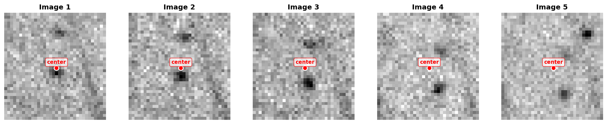
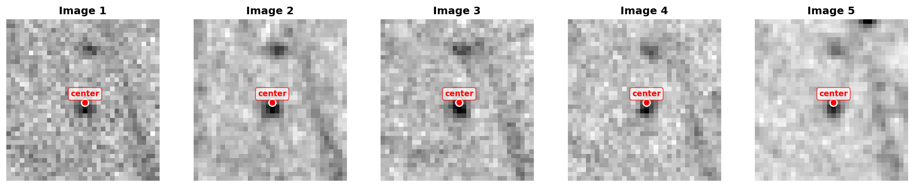

# Image Alignment Pipeline

This pipeline is designed to align large sequences of 16-bit .tif images from high-resolution monochromatic cameras. Image misalignment may result from vibrations, thermal drift, or other artifacts. It has been tested on the example datasets provided in this repository and validated with real experimental data published in scientific articles [1-4].

## References

1. https://doi.org/10.1016/j.corsci.2025.113184
2. https://doi.org/10.3390/met15080821
3. https://doi.org/10.1021/acs.analchem.3c04160
4. https://doi.org/10.1002/smtd.202300214

## Method Overview

The core methodology is based on manual selection of particles, followed by Gaussian fitting to precisely determine and track their locations. The pipeline then applies drift corrections to transpose images based on the measured particle movements. The approach assumes your images have: rigid body motion (translation + rotation, no shearing or scaling), multiple trackable particles that move together, small incremental drift between consecutive frames. The transformation treats the image as a rigid plane that has shifted and rotated slightly, and the alignment corrects this by applying the inverse transformation to bring everything back into a common reference frame.

The following example shows typical results from `example_data1` before and after alignment (center mark added for visual reference):

### Before Alignment



### After Alignment



A detailed technical description of the pipeline is provided below.

## Project Structure

```
image_alignement/
├── scripts/                          # All Python scripts
│   ├── 1_select_particles_for_drift.py
│   ├── 2_parallel_drift_analysis.py
│   ├── 3_aggregate_particle_drift.py
│   ├── 4_batch_gpu_alignment.py
│   ├── 5_validation.py
│   └── logging_utils.py             # Centralized logging utility
├── run_pipeline.sh                   # Automated pipeline runner
├── scripts_output/                   # Created automatically
│   ├── particle_selections.json     # Particle selections (single file)
│   ├── log.txt                      # Centralized log file with timestamps
│   ├── particles_tracking/          # Per-particle drift CSVs
│   ├── particle_drift/              # Aggregated drift CSVs
│   └── validation/                  # Validation results
├── example_data/                     # Example datasets
│   ├── example_data1/               # First example dataset
│   ├── example_data2/               # Second example dataset
│   ├── example_data*_aligned/       # Aligned images (created by script 4)
│   └── only_for_illustration/       # Documentation images
└── requirements.txt                  # Python dependencies
```

## Quick Start

### Option 1: Run Entire Pipeline (Recommended)

```bash
./run_pipeline.sh
```

This will automatically run all 5 steps in sequence.

### Option 2: Run Scripts Individually

```bash
cd scripts

# Step 1: Interactive particle selection
python3 1_select_particles_for_drift.py

# Step 2: Parallel drift analysis
python3 2_parallel_drift_analysis.py

# Step 3: Aggregate particle drift
python3 3_aggregate_particle_drift.py

# Step 4: GPU-accelerated alignment
python3 4_batch_gpu_alignment.py

# Step 5: Validation
python3 5_validation.py
```

## Pipeline Steps

### 1. Particle Selection (`1_select_particles_for_drift.py`)

- Interactive GUI for selecting particles to track
- Validates selections with Gaussian fitting
- Saves selections to JSON in `scripts_output/`
- Logs all activity to console and `log.txt` with timestamps

### 2. Parallel Drift Analysis (`2_parallel_drift_analysis.py`)

- Processes multiple image sets in parallel
- Performs Gaussian fitting on all images
- Tracks particle positions and calculates drift
- Outputs to `scripts_output/particles_tracking/`
- Logs progress and statistics to console and `log.txt`

### 3. Aggregate Particle Drift (`3_aggregate_particle_drift.py`)

- Aggregates per-particle drift to per-image drift
- Calculates rotation using Procrustes alignment
- Generates drift plots
- Outputs to `scripts_output/particle_drift/`
- Logs aggregation results to console and `log.txt`

### 4. Batch GPU Alignment (`4_batch_gpu_alignment.py`)

- GPU-accelerated image alignment
- Applies drift and rotation corrections
- Creates aligned image folders (sibling to input folders)
- Outputs to `{original_folder}_aligned/`
- Logs GPU operations and progress to console and `log.txt`

### 5. Validation (`5_validation.py`)

- Re-analyzes aligned images
- Measures residual drift (should be near zero)
- Generates comparison plots
- Outputs to `scripts_output/validation/`
- Logs validation metrics to console and `log.txt`

## Requirements

### Installation

Install all dependencies using the provided requirements file:

```bash
pip install -r requirements.txt
```

Or install manually:

```bash
pip install napari[all] tifffile numpy scipy scikit-image magicgui
pip install pandas tqdm matplotlib
pip install torch torchvision pillow
```

### System Requirements

- Python 3.8 or higher
- CUDA-capable GPU (optional, for faster alignment in script 4)
- 8+ GB RAM recommended

## Path Handling

All scripts automatically:

- Look for JSON files in `../scripts_output/` (relative to scripts folder)
- Create output directories in `../scripts_output/` hierarchy
- Handle paths correctly when run from `scripts/` directory

## Logging System

All scripts use a centralized logging system (`logging_utils.py`):

- Logs to **both console and `log.txt`** in `scripts_output/`
- Includes timestamps for all operations
- Persistent across pipeline runs (appends to existing log)
- Useful for debugging and tracking pipeline progress
- Worker processes safely write to shared log file

## JSON File Management

The pipeline uses a single JSON file (`particle_selections.json`) that is updated at each step:

- Created by script 1 with particle selections
- Updated by script 2 with CSV file paths
- Updated by script 3 with drift CSV paths
- Updated by script 4 with aligned folder paths
- Updated by script 5 with validation results

## Output Files

### scripts_output/

- `particle_selections.json` - Main configuration file (single file, updated at each step)
- `log.txt` - Centralized log file with timestamps from all pipeline steps
- `particles_tracking/{folder}_{id}.csv` - Per-particle drift data
- `particle_drift/drift_{folder}_{id}.csv` - Aggregated drift data
- `particle_drift/drift_plot_{folder}.png` - Drift visualization
- `validation/{folder}_{id}.csv` - Validation particle data
- `validation/drift_{folder}_{id}.csv` - Validation drift data
- `validation/validation_plot_{folder}.png` - Before/after comparison

### Aligned Images

- Created as sibling folders: `{original_folder}_aligned/`
- Contains aligned TIF files with `_aligned` suffix

## Usage Notes

1. **Always run from the project root directory** (`image_alignement/`)
2. The `scripts_output/` folder is created automatically
3. Scripts auto-discover the JSON file (if only one exists)
4. All scripts use `python3` command
5. GPU alignment will use CUDA if available, otherwise CPU
6. **All pipeline activity is logged to `scripts_output/log.txt`** with timestamps
7. The log file persists across runs - check it for debugging or tracking progress

## Advanced Options

### Script 4 Options:

```bash
python3 4_batch_gpu_alignment.py --batch_size 16 --interpolation bicubic
```

Options:

- `--batch_size`: GPU batch size (default: 8)
- `--interpolation`: bilinear or bicubic (default: bilinear)
- `--device`: cuda, cpu, or auto (default: auto)
- `--suffix`: output folder suffix (default: _aligned)

## Troubleshooting

**"Error: 'scripts_output' folder not found!"**

- The folder is created automatically by script 1
- Make sure you run script 1 first

**"Error: No JSON files found"**

- Run script 1 to create the JSON file
- Or specify JSON path manually: `python3 script.py path/to/file.json`

**"Error: Multiple JSON files found"**

- Specify which file to use: `python3 script.py scripts_output/file.json`

**Path issues**

- Always run scripts from their directory: `cd scripts && python3 script.py`
- Or use the automated runner: `./run_pipeline.sh`

## Expected Results

After successful validation:

- Residual X/Y drift: < 0.1 pixels (typically)
- Residual rotation: < 0.01 degrees (typically)
- High success rate for Gaussian fits: > 90%

## License

This work is licensed under [CC BY 4.0](https://creativecommons.org/licenses/by/4.0/) (Creative Commons Attribution 4.0 International License). You are free to share and adapt this work for any purpose, even commercially, as long as you provide appropriate credit.

## Author

**Viacheslav (Slava) Shkirskiy**  
Website: [https://slava-shkirskiy.org/](https://slava-shkirskiy.org/)  
Contact: viacheslava.shkirskiy@cnrs.fr

For support, questions, or feedback, please contact via email.
